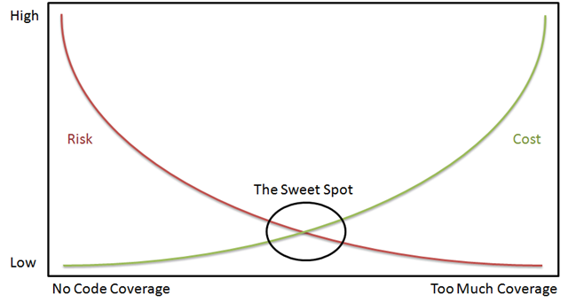
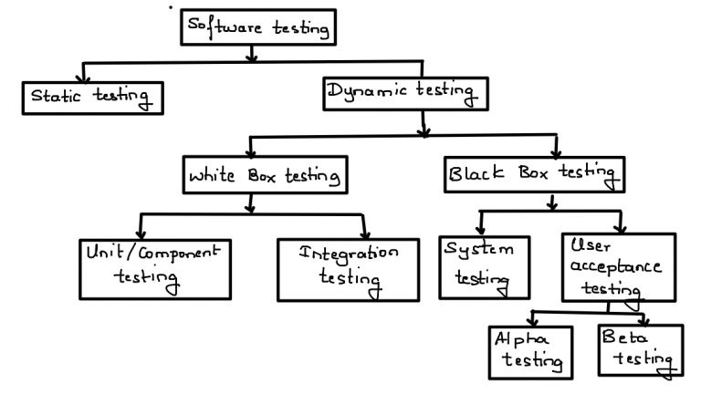
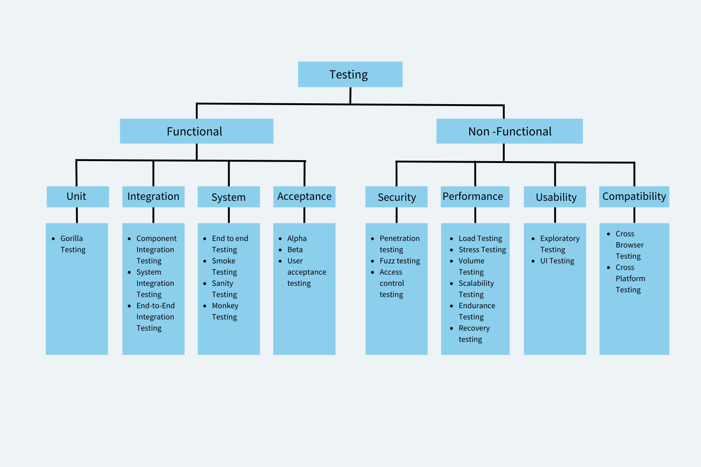
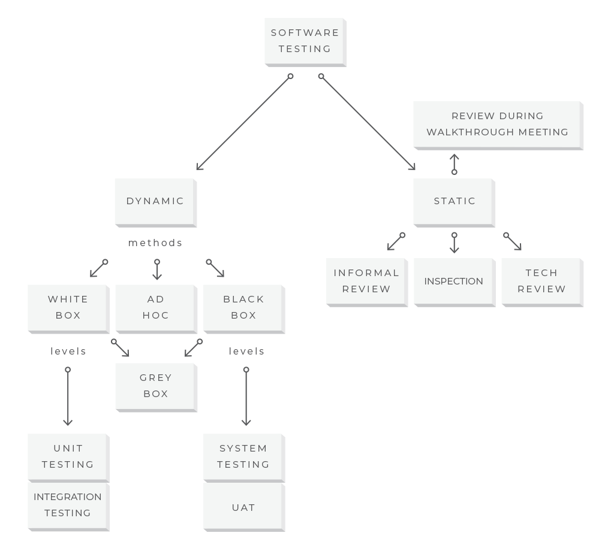
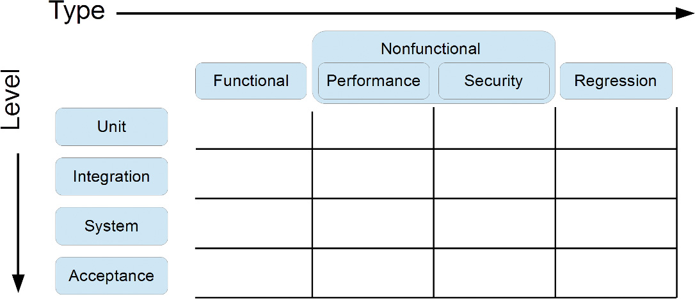
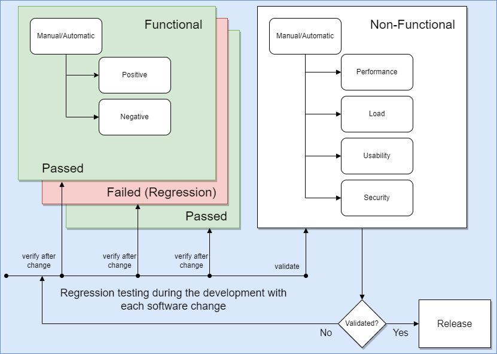

 

### Introduction
___________________________________________________________________________________________________

Testing is part of the Quality Assurance (QA) and Quality Control (QC) processes. It the narrow 
sense it is the verification and validation of the software during the software development
process. 

In practice the testers do not have any knowledge about the internals of the product and use 
mostly black box testing techniques. In the black box testing scenario the tester is required to 
identify the required functionality, supply it with a test input and compare it with the 
expected output. 

The black box testing is usually divided in two parts. First the functional testing is
used to verify that the software is working correctly.

- When a tested element has a valid input X do I see a correct output Y (positive scenario)?
- When a tested element has an invalid input X do I see the error Y (negative scenario)?

After the development of the product and no further bugs are discovered the non-functional
testing is used to validate the software.

- Is the product API covering the requirements by the client?
- Is the product more performant than previous releases or competiors?
- Is the software secure to be used in trusted enviromnents?
- Is the software robust enough to handle large amount of data?

### Testing benefits
___________________________________________________________________________________________________

As seen in the figure above, testing should start as early as possible. Usually the first is module 
or unit tests performed by the developer himself. The main advantages of the testing process are:

- To find bugs in the software (testing is the only way to do this)
- To minimize risks to both users and the company
- To reduce development and maintenance costs
- To increase productivity

Ideally, we want to test every possible behavior of the program. This implies testing at least 
once every possible combination of inputs or every solution path. Obviously, this ideal 
situation is impossible, so we must use an approximation to this ideal that is also the most 
efficient overall in terms of risk and costs (the sweet spot).

The sweet spot is not easily determined as it depends on the product type, the risk types in 
case of software failure, etc. For example a corportate website might have a very different risk 
profile (mainly financial) than an embedded application (loss of human life). Typically the stop 
criteria for testing are decided based on:

- When a minimum set of features are tested
- When a certain level of coverage is reached with no new bugs discovered
- When the next iteration of tests finds less than X number of bugs
- When the management level decides that the risk is acceptable
- 
### Testing categorization
___________________________________________________________________________________________________

### Testing automation
___________________________________________________________________________________________________

### Testing techniques
___________________________________________________________________________________________________

- **Ad-hoc testing** (basic script or manual tests to exlore the product)
- **Equivalence partitioning** (create value groups)
- **Boundary value** (test the value groups near the limits)
- **Decision tables** (useful to test events and state machines)
- **Use cases** (usually on-demand scripts by the developers)

### Tester activities
___________________________________________________________________________________________________

- Review software documentation
- Design and document test scenarios
- Design and document test plans
- Design or develop automated testing tools.
- Document and report software defects using a bug tracking system
- Provide feedback and recommendations to developers on software usability and functionality.
- Create or maintain databases of known test defects.

### Testcase design
___________________________________________________________________________________________________

1. Each test suit **MUST** have a name convention allowing grouping in categories
2. Each test case **MUST** follow the test suite name convention
3. Each test case **MUST** have an unique ID
4. Each test case **MUST** be atomic and test only one part of a feature
5. Each test case **MUST** answer the test scenario with 'Yest' or 'No' 
6. Each test case **MUST** have a short description consisting of the test input and test output
7. Each test case **MUST** have a short algorithm with easy to follow steps
8. Each test case **SHOULD** return PASSED, FAILED or SKIPPED for better coverage analysis
9. Each test case **SHOULD** be able to be reused in different test groups

### Glossary
___________________________________________________________________________________________________

#### Verification
The process of monitoring whether the software runs correctly.

#### Validation
The process of monitoring whether the software conforms to the customers needs.

### Selected references
___________________________________________________________________________________________________

#### QA
- https://iso25000.com/index.php/en/iso-25000-standards/iso-25010
- https://www.triad.co.uk/news/testing-vs-qa
- https://www.bmc.com/blogs/how-to-write-test-cases-for-software
- https://mozaicworks.com/blog/specification-and-good-specification

#### Software development life cycle
- https://www.javatpoint.com/software-engineering-sdlc-models
- https://www.scnsoft.com/blog/software-development-models
- https://agiletech.medium.com/top-6-software-development-life-cycle-sdlc-models-methodologies-14e421bb4dd1
- https://echoua.com/sdlc-models-full-guide/
- https://stackify.com/what-is-sdlc/
- https://www.sketchbubble.com/en/presentation-spiral-model-in-sdlc.html

#### Testing techniques
- https://www.geeksforgeeks.org/software-testing-techniques/
- https://www.guru99.com/software-testing-techniques.html
- https://www.swtestacademy.com/software-testing-techniques/
- https://www.softwaretestinghelp.com/guide-to-functional-testing/
- https://www.zucisystems.com/software-testing/functional-testing/
- https://www.simform.com/blog/functional-testing/
- https://www.guru99.com/code-coverage.html

### Non-functional tests
 - https://loadninja.com/articles/performance-test-types/

### RFC
- https://datatracker.ietf.org/doc/html/rfc2119

https://lostechies.com/derickbailey/2010/11/11/cost-vs-risk-in-testing/
https://www.browserstack.com/guide/types-of-testing
https://www.h2kinfosys.com/blog/software-testing-classification/
https://www.informit.com/articles/article.aspx?p=2730111&seqNum=3

### Credits
___________________________________________________________________________________________________

 - [Branimir Georgiev](https://github.com/braboj)

